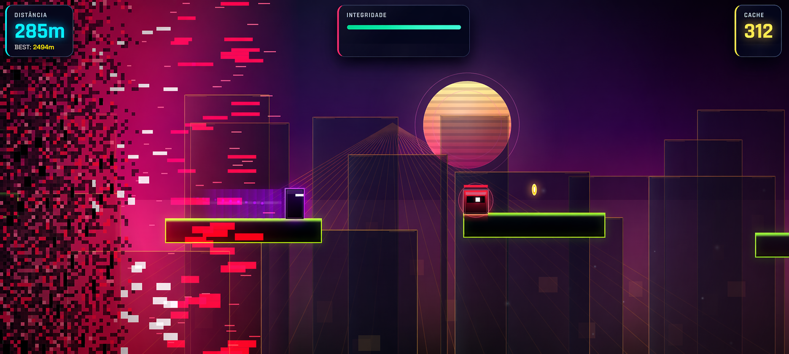

# AETHERIS — Permadeath Record

> Endless runner 2D em Vanilla JavaScript e HTML5 Canvas, desenvolvido sem engine, com física customizada, geração procedural, arquitetura modular e escalonamento dinâmico de dificuldade.

**Demo:** [Jogar agora](https://aetheris-permadeath-record.netlify.app)  
**Issues:** [Reportar bug](../../issues)

---



*Frame real de gameplay no modo difícil.*

---

## Visão geral

AETHERIS é um endless runner 2D de plataforma com estética cyberpunk, construído inteiramente com JavaScript puro e Canvas HTML5. O projeto foi desenvolvido sem engine e sem framework, com foco em controle fino sobre loop de jogo, física, renderização, balanceamento e organização de código.

O jogo possui três modos de dificuldade, progressão contínua de velocidade, geração procedural de elementos do mapa e persistência local de progresso. No modo difícil, uma parede de corrupção digital avança pelo cenário e transforma a corrida em uma disputa constante contra pressão crescente.

---

## Stack

- Vanilla JavaScript (ES Modules)
- HTML5 Canvas 2D
- CSS
- Web Audio API
- localStorage

---

## Controles

- `A` / `D` ou `←` / `→`: mover
- `W` / `↑` / `Espaço`: pular
- `C`: dash / ataque
- `P` ou `Esc`: pause / continuar
- `S`: abrir loja de skins
- `1`, `2`, `3`: trocar dificuldade

---

## Principais funcionalidades

- Geração procedural de plataformas, obstáculos, inimigos e moedas
- Três modos de dificuldade com comportamentos distintos
- Sistema de boosts coletáveis
- Loja de skins com desbloqueio por moedas
- Física de plataforma com coyote time e jump buffer
- Ciclo dinâmico de dia e noite
- Background com parallax em múltiplas camadas
- Skyline cyberpunk com silhuetas variadas, antenas de transmissão, letreiros verticais e outdoors easter egg em homenagem ao gênero (Blade Runner / Cloudpunk)
- Janelas com paleta cyan/magenta/âmbar e iluminação determinística (sem flicker em massa)
- Qualidade gráfica adaptativa com ajuste automático por desempenho
- SFX gerados em tempo real com Web Audio API
- Persistência local de recorde, moedas, skins e preferências
- Sistema visual de corrupção digital no modo difícil, com renderização adaptativa (culling vertical + escala de qualidade dinâmica) para manter fluidez
- Pause inteligente com tela dedicada e suspensão completa da simulação

---

## Destaques técnicos

### 1. Arquitetura modular

O projeto começou como um protótipo monolítico e foi evoluído para uma estrutura modular separada por responsabilidade:

- `core/`: engine, estado global, storage, validação, áudio e utilitários
- `entities/`: jogador e inimigos
- `systems/`: geração de mundo, UI, background, partículas, vírus e VFX

Esse refactor reduziu acoplamento, melhorou manutenção e facilitou expansão de features.

### 2. Física responsiva

A movimentação foi ajustada para aumentar precisão e sensação de controle:

- **Coyote time**: permite pular por alguns frames após sair da borda
- **Jump buffer**: registra o comando de pulo pouco antes da colisão com o chão

Esses dois mecanismos reduzem frustração em inputs limítrofes e tornam o gameplay mais consistente.

### 3. Escalonamento de dificuldade no modo difícil

A versão inicial do modo difícil usava crescimento linear de pressão. O resultado era um problema de balanceamento: após certa distância, a perseguição se tornava injusta cedo demais.

A solução foi substituir esse crescimento por uma curva com saturação progressiva, mantendo o modo ameaçador sem quebrar cedo a curva de aprendizagem. Isso transformou o sistema em uma pressão crescente de verdade, em vez de uma inevitabilidade arbitrária.

### 4. Renderização e efeitos em Canvas

O efeito visual de corrupção digital utiliza composição de camadas no Canvas para gerar sensação de desintegração do cenário em tempo real. O sistema combina partículas, resíduos pixelados, brilho, apagamento parcial e pulsação de cor para construir a identidade visual do modo difícil.

### 5. Qualidade gráfica adaptativa

O jogo monitora tempo médio de frame e ajusta automaticamente o nível de detalhe visual. Isso reduz custo de renderização em hardware mais fraco sem exigir configuração manual do usuário.

### 6. Áudio procedural

Os efeitos sonoros principais são sintetizados em tempo real via Web Audio API. Isso reduz dependência de arquivos externos para SFX e mantém o projeto mais controlado no nível de implementação.

---

## Estrutura do projeto

```text
GG/
├── public/
│   └── index.html
├── src/
│   ├── config.js
│   ├── main.js
│   ├── core/
│   │   ├── engine.js
│   │   ├── state.js
│   │   ├── storage.js
│   │   ├── audio.js
│   │   ├── sprites.js
│   │   ├── boostSprites.js
│   │   ├── utils.js
│   │   └── validation.js
│   ├── entities/
│   │   ├── player.js
│   │   └── enemy.js
│   └── systems/
│       ├── worldgen.js
│       ├── background.js
│       ├── ui.js
│       ├── particles.js
│       ├── virus.js
│       └── vfx.js
├── assets/
│   ├── audio/
│   └── img/
└── styles/
    └── main.css
```
