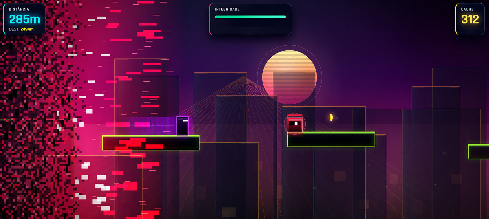

# AETHERIS — Permadeath Record

> Endless runner 2D em Vanilla JavaScript e HTML5 Canvas, desenvolvido sem engine, com física customizada, geração procedural, arquitetura modular e escalonamento dinâmico de dificuldade.

**Demo:** [Jogar agora](https://aetheris-permadeath-record.netlify.app)  
**Issues:** [Reportar bug](../../issues)

---



*Frame real de gameplay no modo difícil.*

---

## Visão geral

AETHERIS é um endless runner 2D de plataforma com estética cyberpunk, construído inteiramente com JavaScript puro e Canvas HTML5. O projeto foi desenvolvido sem engine e sem framework, com foco em controle fino sobre loop de jogo, física, renderização, balanceamento e organização de código.

O jogo possui três modos de dificuldade, progressão contínua de velocidade, geração procedural de elementos do mapa e persistência local de progresso. No modo difícil, uma parede de corrupção digital avança pelo cenário e transforma a corrida em uma disputa constante contra pressão crescente.

---

## Stack

- Vanilla JavaScript (ES Modules)
- HTML5 Canvas 2D
- CSS
- Web Audio API
- localStorage
- Netlify Functions
- SQLite (`sql.js`) persistido em Netlify Blobs
- GitHub Actions
- Playwright / Node Test Runner

---

## Controles

- `A` / `D` ou `←` / `→`: mover
- `W` / `↑` / `Espaço`: pular
- `C`: dash / ataque
- `P` ou `Esc`: pause / continuar
- `S`: abrir loja de skins
- `1`, `2`, `3`: trocar dificuldade

---

## Principais funcionalidades

- Geração procedural de plataformas, obstáculos, inimigos e moedas
- Três modos de dificuldade com comportamentos distintos
- Sistema de boosts coletáveis
- Loja de skins com desbloqueio por moedas
- Física de plataforma com coyote time e jump buffer
- Ciclo dinâmico de dia e noite
- Background com parallax em múltiplas camadas
- Skyline cyberpunk com silhuetas variadas, antenas de transmissão, letreiros verticais e outdoors easter egg em homenagem ao gênero (Blade Runner / Cloudpunk)
- Janelas com paleta cyan/magenta/âmbar e iluminação determinística (sem flicker em massa)
- Qualidade gráfica adaptativa com ajuste automático por desempenho
- SFX gerados em tempo real com Web Audio API
- Persistência local de recorde, moedas, skins e preferências
- Sistema visual de corrupção digital no modo difícil, com renderização adaptativa (culling vertical + escala de qualidade dinâmica) para manter fluidez
- Pause inteligente com tela dedicada e suspensão completa da simulação
- Leaderboard global por dificuldade, visível no pré-jogo e oculto durante gameplay
- Contas opcionais com modo convidado preservado, sessão segura em cookie HttpOnly e senha com hash `scrypt`
- Pirâmide de testes com checagem estática, unitários, integração e E2E

---

## Destaques técnicos

### 1. Arquitetura modular

O projeto começou como um protótipo monolítico e foi evoluído para uma estrutura modular separada por responsabilidade:

- `core/`: engine, estado global, storage, validação, áudio e utilitários
- `entities/`: jogador e inimigos
- `systems/`: geração de mundo, UI, background, partículas, vírus e VFX
- `netlify/functions/`: API serverless do leaderboard, banco SQLite e válvulas anti-cheat

Esse refactor reduziu acoplamento, melhorou manutenção e facilitou expansão de features.

### Leaderboard, contas e anti-cheat

O ranking global roda em Netlify Functions e persiste um arquivo SQLite em Netlify Blobs, evitando dependência de serviços externos como Supabase. Cada corrida abre uma sessão curta no servidor e a submissão do score valida modo, duração, velocidade plausível, token de uso único, duplicidade de corrida e rate limit por origem antes de entrar no ranking verificado.

As contas são opcionais. Quem não quiser login continua jogando como convidado, com callsign salvo no navegador. Quem cria conta passa a ter um perfil salvo no banco; a sessão usa cookie HttpOnly/Secure/SameSite e as senhas são armazenadas com hash `scrypt` e salt individual. Quando a Netlify não fornece um segredo via ambiente, a API gera um segredo interno persistido no SQLite/Blobs, evitando depender de configuração manual para proteger hashes operacionais.

### Qualidade e CI

O projeto possui uma pirâmide de testes executada localmente e no GitHub Actions:

```bash
npm run test:static       # sintaxe JS/MJS/MTS
npm run test:unit         # regras de auth/normalizacao/sessao
npm run test:integration  # banco + ranking + conta/convidado
npm run test:e2e          # smoke de UI pre-corrida desktop/mobile
npm test                  # piramide completa
```

O workflow `.github/workflows/qa.yml` roda a pirâmide em push e pull request para `main`. O deploy continua pelo fluxo GitHub -> Netlify já vinculado ao projeto.

### 2. Física responsiva

A movimentação foi ajustada para aumentar precisão e sensação de controle:

- **Coyote time**: permite pular por alguns frames após sair da borda
- **Jump buffer**: registra o comando de pulo pouco antes da colisão com o chão

Esses dois mecanismos reduzem frustração em inputs limítrofes e tornam o gameplay mais consistente.

### 3. Escalonamento de dificuldade no modo difícil

A versão inicial do modo difícil usava crescimento linear de pressão. O resultado era um problema de balanceamento: após certa distância, a perseguição se tornava injusta cedo demais.

A solução foi substituir esse crescimento por uma curva com saturação progressiva, mantendo o modo ameaçador sem quebrar cedo a curva de aprendizagem. Isso transformou o sistema em uma pressão crescente de verdade, em vez de uma inevitabilidade arbitrária.

### 4. Renderização e efeitos em Canvas

O efeito visual de corrupção digital utiliza composição de camadas no Canvas para gerar sensação de desintegração do cenário em tempo real. O sistema combina partículas, resíduos pixelados, brilho, apagamento parcial e pulsação de cor para construir a identidade visual do modo difícil.

### 5. Qualidade gráfica adaptativa

O jogo monitora tempo médio de frame e ajusta automaticamente o nível de detalhe visual. Isso reduz custo de renderização em hardware mais fraco sem exigir configuração manual do usuário.

### 6. Áudio procedural

Os efeitos sonoros principais são sintetizados em tempo real via Web Audio API. Isso reduz dependência de arquivos externos para SFX e mantém o projeto mais controlado no nível de implementação.

---

## Estrutura do projeto

```text
GG/
├── public/
│   └── index.html
├── src/
│   ├── config.js
│   ├── main.js
│   ├── core/
│   │   ├── engine.js
│   │   ├── state.js
│   │   ├── storage.js
│   │   ├── audio.js
│   │   ├── sprites.js
│   │   ├── boostSprites.js
│   │   ├── utils.js
│   │   └── validation.js
│   ├── entities/
│   │   ├── player.js
│   │   └── enemy.js
│   └── systems/
│       ├── worldgen.js
│       ├── background.js
│       ├── ui.js
│       ├── particles.js
│       ├── virus.js
│       └── vfx.js
├── assets/
│   ├── audio/
│   └── img/
└── styles/
    └── main.css
```
